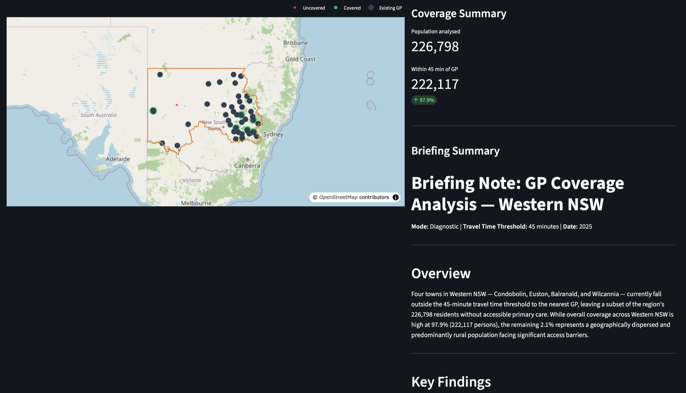
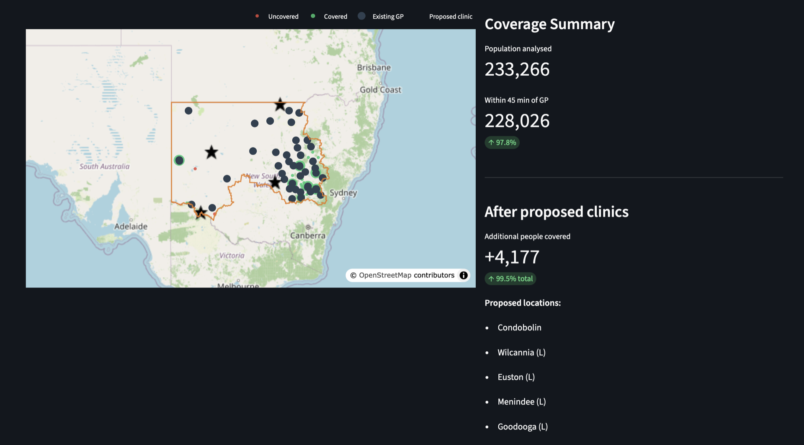
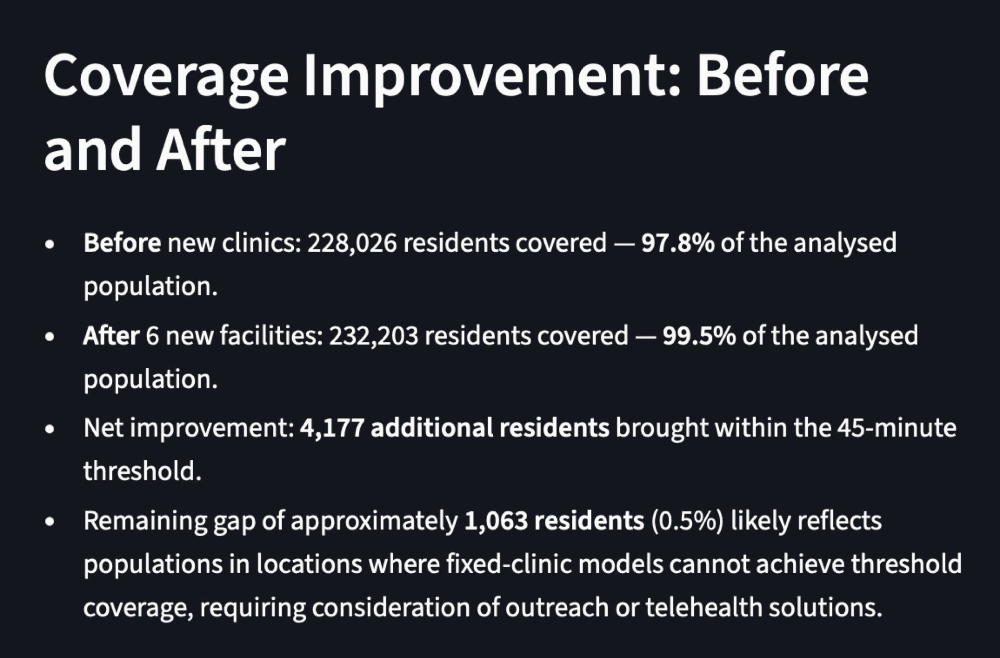

<!-- _class: lead -->
<!-- _paginate: false -->

# Meridian: Health Facility Planning

 
Ask a plain-English question. Get an optimised answer in seconds.

Ching Chew · April 2026

 

<!-- note:
Pre-show: Streamlit app running locally, Western NSW PHN loaded, cache warm.
-->

---

## The Planner's Dilemma

A PHN lead is asked:

> "Where should we commission two new GP clinics to maximise coverage for rural communities in Western NSW?"

- They have a budget
- They have a workforce shortage classification map
- They have no way to answer the question independently
 

**What happens next?**

<!-- note:
Don't answer the question. Let it sit.

Every person in the room should think of a real planning decision they've watched stall waiting for analysis.

Who would you call? How long would it take to get an answer you could defend?

That gap is what this demo is about.

For exec audiences: lead with the decision-support angle. The tool answers a question they couldn't answer independently, in seconds, with a briefing-quality narrative ready to put in a planning document.
For dev/GIS audiences: the interesting part is the architecture — LLM handles NL translation, classical solver handles optimisation. Neither replaces the other.
-->

---

## How It's Done Today

- GIS analysts translate policy questions into spatial queries
- Turnaround: days to weeks, depending on queue
- Output: a map that lives in an email attachment
- What-if questions ("what if we added a third clinic?") require a new request
 

**GIS specialists are scarce. Repetitive what-if queries might not be the highest-value use of their time.**

<!-- note:
This is not a criticism of GIS teams. It is a structural problem.

The tool handles the repetitive "which towns lack coverage?" and "where should we place k new facilities?" queries so GIS staff have more time for the integrations, datasets and analysis that actually need their expertise.

For GIS practitioners in the room: frame this as additive, not competitive.
-->

---

<!-- _class: break -->

<!-- note:
Left: Mode 1 output. Coverage gap diagnostic. Towns without a GP within 45 minutes shown in red/amber.

No narration needed. Let the gap do the work.

"That's the question. That's the answer. The time between: seconds."
-->

---

<!-- _class: break -->
<!-- _paginate: false -->

# Live Demo

Mode 1 - Coverage Gap Diagnostic

<!-- note:
Demo narration:
1. Show the app interface - text input, mode toggle, suggested queries
2. Type (or click): "Which towns in Western NSW with more than 500 people are more than 45 minutes from the nearest bulk-billing GP?"
3. Point out the mode toggle auto-set to Diagnostic
4. Run. Note the structured parameters shown in the sidebar (threshold, region, pop_min)
5. Map renders: choropleth showing coverage gaps
6. Narrative panel: briefing-quality text naming the towns explicitly, population affected

For exec audiences: "The narrative is ready to go into a planning document."
For dev audiences: "The model filled a typed schema. No parsing. The map is Folium rendered in Streamlit."
-->

---

## How It Works

Seven components. Two Claude API calls.

The LLM translates the question and writes the answer. A 40-year-old algorithm does the optimisation.

<!-- note:
Walk through left to right:
1. Streamlit UI: text input and mode toggle
2. NL Input Layer: Claude tool use parses the query into typed params (region, threshold, k, pop_min)
3. Spatial Data: GeoPandas + DuckDB/Parquet - population centres, GP locations, PHN boundaries
4. Routing: ArcGIS Online OD Matrix REST API - travel time from every demand point to every facility. Pre-computed and cached as Parquet for the demo.
5. MCLP Solver: PuLP integer program - finds k sites maximising covered population. Runs in seconds at PHN scale.
6. Output Layer: Claude narrative - structured results in, briefing note out. Raw user input never reaches this prompt.
7. Folium/Plotly: choropleth map + stats panel in Streamlit

For GIS audiences: ORS (OpenRouteService) is implemented as an open-source alternative routing provider.
For exec audiences: "Connects tools your organisation already has or can access."
-->

---

## Key Technical Decisions

### Claude tool use for query parsing
- NL to typed `QueryParams` via forced tool call
- Schema validation catches edge cases; model never reasons spatially

### MCLP for optimisation
- Maximal Coverage Location Problem: textbook correct for facility location
- PuLP integer program; runs in seconds at PHN scale (~50 demand points, ~100 candidates)

### Parquet routing cache
- ArcGIS Online OD Matrix pre-computed offline
- Live demo reads from disk: no API latency, no call quota consumed

<!-- note:
Decision 1: the alternative was asking the LLM to reason spatially. It can't reliably. Tool use with a tight schema sidesteps the problem entirely.

Decision 2: MCLP is from 1974. The contribution here is not the algorithm - it's making it accessible via a natural language interface.

Decision 3: ArcGIS Online is the accurate option for Australian road networks. ORS is implemented as a fallback for open-source deployments. Cache means the demo is deterministic and fast regardless of API availability.

For developers: the full tool definition and solver code are in the GitHub repo.
-->

---

<!-- _class: break -->

<!-- note:
Right: Mode 2 output. Same map with optimised clinic locations overlaid. Green markers show proposed sites. The gap shrinks.

No narration needed. Let the gap do the work.

"That's the question. That's the answer. The time between: seconds."
-->

---

<!-- _class: break -->
<!-- _paginate: false -->

# Live Demo

Mode 2 - Facility Optimisation

<!-- note:
Demo narration:
1. Switch to prescriptive query
2. Type (or click): "Where would you place 6 new GP clinics in Western NSW to maximise population coverage within 45 minutes?"
3. Point out k=6, mode=prescriptive in the parsed params
4. Run. MCLP solver selects the 6 sites.
5. Map: proposed markers overlaid on existing GP locations
6. Stats panel: before/after coverage numbers
7. Narrative: briefing note with proposed locations named, population gain quantified

"That took about 10 seconds. How long would an equivalent GIS request?"

Audience question to seed: "What would you do differently with this answer?"
-->

---

<!-- _class: break -->

<!-- note:
The before/after panel is the executive proof point.

Read out the numbers. Coverage gain is the headline.

For policy audiences: reference the November 2025 Bulk Billing Practice Incentive Program - the narrative layer already incorporates this context when assessing viability of proposed sites.

"The specialist still applies judgment on top. But now from a defensible quantitative baseline, not from scratch."
-->

---

## Lessons Learnt

- **Data sourcing was harder than the solver.** No authoritative geocoded GP dataset exists. GP practice locations came from a Nov 2025 Healthdirect snapshot; rural practices without precise coordinates were placed at their postcode centre.
- **The LLM was not the hard part.** Tool use for query parsing worked first attempt with a clear schema.
- **Scope discipline was the most important decision.** Western NSW PHN only. GP only. Everything else went to a limitations section.
- **Candidate site derivation is approximate.** Straight-line distance pre-filter; some candidates are slightly mis-ranked before routing validation.
 

**The 45-minute threshold is a policy assumption, not a model output. That distinction matters.**

<!-- note:
"I'm showing you a pattern and being straight about where it ends."

For GIS practitioners: the uniform coverage objective is a known limitation. MCLP doesn't weight by health need, disease burden or socioeconomic vulnerability. A demand-weighted variant is the next iteration.

For executives: the tool produces the rigorous analytical baseline. It replaces the wait, not the judgment.

Teams adaptation: same architecture, same solver. Different routing provider if ArcGIS licence is unavailable (ORS).
-->

---

## The Bigger Pattern

The same architecture applies anywhere a powerful analytical tool sits behind a specialist translation layer.

- **Procurement evaluation**: NL → scoring criteria, evaluation engine rates tender submissions, LLM writes value-for-money assessment
- **Infrastructure business case**: NL → demand inputs, cost-benefit model runs, LLM writes strategic assessment note
- **Workforce planning**: NL → scenario parameters, supply/demand model runs, LLM writes budget submission narrative

 

**The entry barrier was never the tool. It was the training required to operate it.**

<!-- note:
"So what" moment. Seed the question for the room: "What analytical capability in your organisation is locked behind a specialist translation layer right now?"

For health informatics audiences: the same pattern applies to clinical decision support tools, resource allocation models, epidemiological projections.

GIS teams freed from repetitive what-if queries get their time back for the integrations, datasets and analysis that actually need their expertise. Additive, not competitive.
-->

---

## Conclusion

- Spatial decision science exists and works. The barrier is access to GIS specialists.
- Structured tool use removes the translation bottleneck without removing the tool.
- Policy staff get self-service access to rigorous analysis. GIS specialists get their time back.
 

- Thank you for your time
- Questions and feedback: DM on LinkedIn or via email

<!-- note:
Landing message: the contribution is not the algorithm. It is removing the expert-translation bottleneck.

For exec audiences: this is a force multiplier for expertise that is always in short supply.
For dev/GIS audiences: the pattern is reusable. The repo is public.

Do not end on a roadmap or product slide. End on the insight.
-->

---

<!-- _class: appendix -->
<!-- _paginate: false -->

## Appendix A - Production Considerations

**Data freshness**
- GP locations: NHSD snapshot (Nov 2025). Needs quarterly refresh pipeline.
- Population: 2021 Census. 2026 Census will materially change rural demand estimates.

**Authentication and access**
- ArcGIS Online: developer licence is adequate for demo; production needs an organisational licence with API rate management.

**Data sensitivity**
- Patient data is never in scope. PHN boundaries, facility locations and population figures are all public.
- Above OFFICIAL: self-hosted model (Ollama, Azure Government-hosted) replaces Claude API calls.

**Scalability**
- PHN-scale MCLP runs in under 2 seconds. National scale (2,400+ localities) requires pre-computed OD matrix and a solver with tighter time limits.

<!-- note:
Cover only if time permits or directly asked.

Data residency is the first question executives will ask. The answer: no patient data, all inputs are public datasets, Claude API receives structured data not raw queries.

ArcGIS licence: existing organisational licences typically cover REST API calls. Verify with ESRI account manager before moving beyond demo scope.
-->

---

<!-- _class: appendix -->
<!-- _paginate: false -->

## Appendix B - Data Sources and Routing Alternatives

| Dataset | Source | Notes |
|---|---|---|
| PHN boundaries | AIHW GeoJSON | 31 PHN regions |
| Population localities | ABS (ASGS + ERP) | 2021 Census |
| GP/facility locations | NHSD snapshot | Nov 2025; postcode centroid fallback |
| District of Workforce Shortage | DoH Shapefile | DPA classification signal |
| ARIA+ remoteness | AIHW/ABS | Contextual layer for narrative |

**Routing alternatives**

| Provider | Accuracy | Cost | Notes |
|---|---|---|---|
| ArcGIS Online OD Matrix | High (AU road network) | Licence-based | Primary provider |
| OpenRouteService | Good | Free tier available | Open-source fallback (`ROUTING_PROVIDER=ors`) |

<!-- note:
For GIS practitioners: NHSD is the most complete public source for GP locations but has known gaps in rural areas. Supplement with HWD regional counts as a cross-check.

ORS works well for the demo. ArcGIS Online is more accurate for regional and remote road networks where routing complexity is highest.
-->

---

<!-- _class: appendix -->
<!-- _paginate: false -->

## Appendix C - National Scale

**What already works at national scale**
- PHN boundary and population data are national
- MCLP solver scales linearly with candidate count; no algorithmic blocker
- ORS free tier covers national routing for moderate call volumes

**Two blockers**

1. **Routing API cost**: full OD matrix for 2,400+ Australian localities at national scale is significant call volume. Mitigation: pre-compute once, refresh quarterly, store as Parquet.
2. **PHN boundary edge cases**: PHNs are defined as SA3 aggregates, but ABS locality polygons don't always align to SA3 boundaries. Localities near PHN borders can straddle two PHNs. Current implementation allocates by locality centroid (standard approach); this works for most cases but edge towns need explicit handling.

<!-- note:
For technical decision-makers: the blockers are engineering problems, not research problems. Both have clear solutions.

The national routing pre-compute is a one-time cost. Once computed and cached, incremental updates (new facilities, updated populations) are cheap.
-->

---

<!-- _class: appendix -->
<!-- _paginate: false -->

## Appendix D - Demand Model Extension

**Current limitation**: MCLP maximises raw population coverage. It does not weight by health need.

**Extension: demand-weighted MCLP**

Replace population count with a composite demand score:

- PPH (Potentially Preventable Hospitalisations) rate by locality - captures unmet primary care need
- DPA classification - existing DoH workforce shortage signal
- Chronic disease prevalence (AIHW) - demand-side load factor

The solver formulation is identical: replace `pops[i]` with `demand_scores[i]`. The policy interpretation changes significantly.

**LLM autoresearch loop**

For each proposed site, the output layer could query PubMed/AIHW publications for evidence on facility placement in similar geographies, surfacing relevant citations in the narrative automatically.

<!-- note:
For health informatics audiences: the PPH variable is the most defensible demand proxy. It is publicly available at LGA level from AIHW and maps reasonably well to PHN geographies.

The autoresearch loop is a future iteration. The current architecture is already set up for it: the output layer makes a Claude API call with structured data. Extending to tool use with a search tool is a small change.
-->
